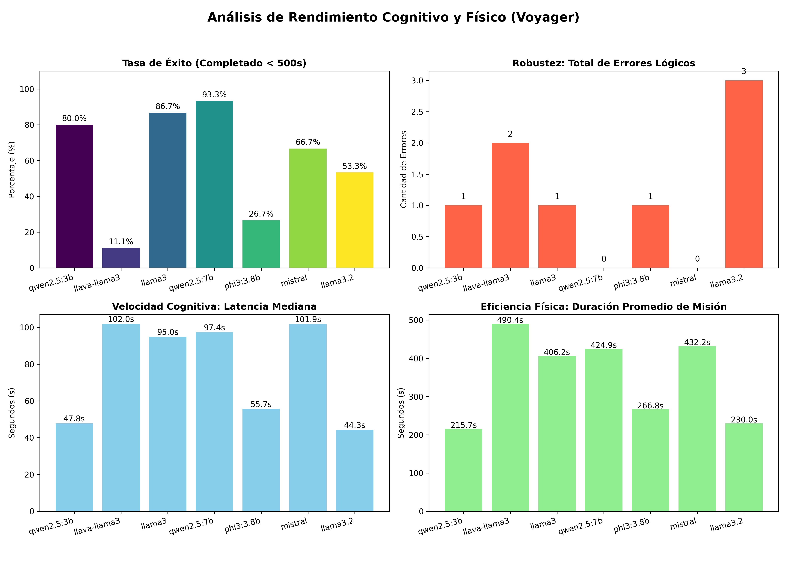

# Arquitectura de Agente Generalista (Estilo VOYAGER)
**Estado**: Estable | **Paradigma**: Planificador de Alto Nivel Orientado a Eventos
A diferencia de la navegación estricta por nodos y odometría discreta, esta arquitectura utiliza al modelo de lenguaje (LLM) exclusivamente como un planificador de alto nivel (High-Level Planner). El razonamiento semántico se ha desacoplado por completo de la ejecución física, delegando el movimiento continuo en 3D al motor interno (NavMeshAgent).  

## 1. Flujo de Ejecución Orientado a Eventos
Para mitigar la latencia natural de los modelos locales (ej. Llama 3 vía Ollama), el agente no evalúa su entorno en cada frame. Opera bajo dos estados mutuamente excluyentes:
* **Modo Exploración (Sistema 0 - Inercia)**: El agente vaga libremente por el NavMesh esquivando obstáculos. El LLM está inactivo. La latencia es 0s.
* **Modo Cognitivo (Sistema 2 - Razonamiento)**: Se activa únicamente cuando el escáner visual (OverlapSphere) detecta una entidad que no está en la memoria semántica, o cuando termina de interactuar con una. El agente clava los frenos físicos y espera la directiva del LLM.

## 2. Estructura de Datos (API Inputs & Outputs)
El puente entre Unity (C#) y FastAPI (Python) se realiza mediante DTOs (Data Transfer Objects) estrictamente formateados en JSON.
### A. INPUT: VoyagerStateRequest (Lo que el agente "siente")
El contexto crudo que Unity envía a Python. Incluye el "Filtro de Realidad" para evitar memorias fantasma (entidades destruidas o recogidas se purgan antes de enviar).

| Campo | Tipo | Descripción |
| ----- | ---- | ----------- |
| *mission* | String | La directiva principal estática (ej: "Find a DataModule...").
| *inventory* | Array[String] | Lista de identificadores de objetos recogidos.
| *known_entities* | Array[EntityDTO] | Lista de objetos en el radar actual y memoria persistente.

**Estructura de EntityDTO**:
* *`id`*: Identificador único (ej: "Data_Alpha_01").
* *`type`*: Categoría base para el LLM (ej: "DataModule").
* *`description`*: Pista semántica inyectada en Unity para que el LLM deduzca su utilidad.
* *`distance`*: Distancia en metros desde el agente para evaluar prioridades espaciales.

### B. OUTPUT: VoyagerDecisionResponse (Lo que el cerebro "decide")
La inferencia generada por el LLM tras evaluar las descripciones contra su inventario actual.

| Campo | Tipo | Descripción |
| ----- | ---- | ----------- |
| *`thought`* | String | Cadena de pensamiento (Chain of Thought). Fundamental para debuggear por qué tomó la decisión.
| *`action`* | String | Verbo de acción estricto. Actualmente soporta `EXPLORE` o `INTERACT`.
| *`target_id`* | String | El id de la entidad objetivo. Devuelve *NONE* si la acción es explorar.
| *`latency_seconds`* | Float | Métrica de rendimiento del hardware de inferencia local.

## 3. Componentes Modulares del Sistema
1. **Entorno Polimórfico (`InteractableEntity`)**:
    
    Clase base de la que heredan todos los objetos. Contiene la semántica y un método virtual Interact(VoyagerAgent agent). Esto permite que el LLM sea completamente agnóstico a las mecánicas de los videojuegos; el LLM solo pide "Interactuar" y C# se encarga de saber si eso significa recoger un ítem, abrir una puerta o hackear un servidor.

2. **Cuerpo y Sensores (`VoyagerAgent`)**:
    
    Maneja el bucle infinito de exploración libre (while(true)) y detiene las corrutinas de forma segura mediante un manejador de estado (currentActionCoroutine). Dibuja Gizmos en el editor para calibrar los radios de visión y de interacción (alcance de los "brazos").

3. **Cerebro (`server_voyager.py`)**:

    Servidor FastAPI que inyecta los datos de Unity en un prompt estructurado de instrucciones y obliga al modelo local a devolver un objeto JSON validado, eliminando la necesidad de parseos complejos con expresiones regulares en C#.
    
## Análisis Clínico del Log de Prueba (Validación de Arquitectura)
1. **Descarte de Ruido Semántico (00:59s)**: El agente detecta Broken_Robot_Arm. El LLM lee la descripción `"rusted metal with no practical use"` e infiere correctamente que es basura. Retoma la exploración sin acercarse.
2. **Manejo de Dependencias Lógicas (01:54s)**: Detecta la meta final (Core_Server_Omega). En lugar de ir ciegamente hacia él e interactuar (lo cual fallaría en C#), el LLM revisa su inventario, nota que le falta el DataModule, y decide postergar el servidor para seguir explorando.
3. **Resolución y Actualización de Estado (02:54s)**: Detecta y recoge el Data_Alpha_01. Al desaparecer de la escena, el "Filtro de Realidad" en C# purga el módulo de la memoria.
4. **Cierre de Misión (03:54s)**: En la siguiente evaluación, con la llave en el inventario y el servidor a la vista en la memoria persistente, el LLM emite el comando de interacción final.

# Resultados de las pruebas
