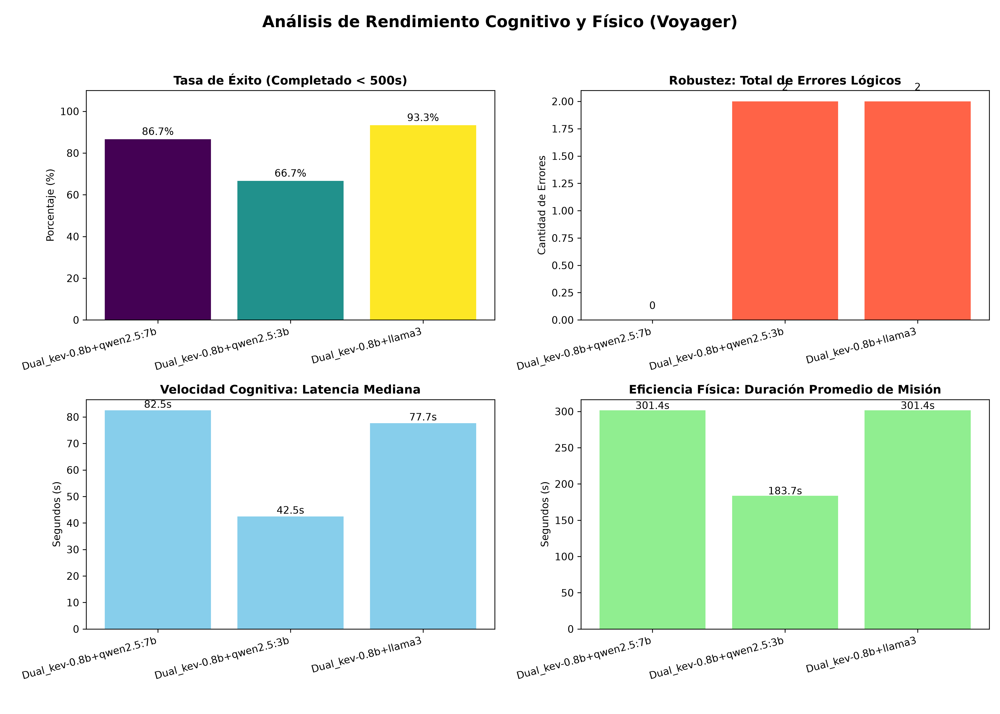

# Arquitectura de Agente de Sistema Dual (Voyager v2)
**Estado**: Experimental / En Pruebas | **Paradigma**: Teoría de Procesos Duales (Fast & Slow Thinking)

Esta iteración evoluciona desde el planificador monolítico de la versión 1 hacia un enrutador cognitivo de dos niveles. Para resolver el compromiso entre la precisión lógica de los modelos grandes (7B/8B) y la velocidad de los modelos pequeños (0.5B/0.8B), el agente emula el comportamiento humano dividiendo su cerebro en dos subsistemas que operan en puertos independientes.   
## 1. Topología del Cerebro Híbrido
La arquitectura *`Dual_kev-0.8b+llama3`* delega las decisiones basándose en el contexto del agente. 

### Sistema 1 (Filtro Perceptual Reactivo)
* **Modelo**: *`kev-0.8b`* (ejecutándose en local vía puerto 8009).
* **Rol**: Procesamiento instintivo de bajo costo. Actúa como los reflejos del agente.
* **Mecánica**: Utiliza el formato predictivo *noul* de Kev para devolver una probabilidad matemática (0.0 a 1.0) sobre la relevancia de un objeto.   
* **Umbral**: Si la certeza de que un objeto es útil es menor o igual al 50% (0.50), el Sistema 1 lo descarta inmediatamente como ruido o chatarra, ahorrando docenas de segundos de latencia.

### Sistema 2 (Planificador Deliberativo)
* **Modelo**: *`llama3`* o *`qwen2.5`* (ejecutándose en local vía Ollama en puerto 11434).
* **Rol**: Razonamiento complejo, planificación a largo plazo y seguimiento estricto de JSON.
* **Mecánica**: Evalúa el inventario completo, las distancias y los requisitos de la misión para emitir verbos de acción (`INTERACT` o `EXPLORE`).

## 2. Lógica de Enrutamiento Cognitivo (El Orquestador)
El servidor FastAPI en `server_voyager_v2.py` evalúa qué modelo despertar utilizando las siguientes reglas:   
1. **Detección de Novedad**: Cuando el agente descubre un objeto y tiene su inventario vacío `(len(state.inventory) == 0)`, el orquestador intercepta la solicitud y la desvía al Sistema 1.
2. **Descarte Inmediato**: Si el Sistema 1 clasifica el objeto como irrelevante, el orquestador fuerza un comando `EXPLORE` hacia Unity sin despertar a Ollama.
3. **Escalamiento**: Si el Sistema 1 clasifica el objeto como útil, si el Sistema 1 falla (caída del servidor), o si el agente ya posee ítems y necesita pensar cómo combinarlos, el orquestador invoca al Sistema 2 para una deliberación completa.

## 3. Optimizaciones de Rendimiento
* **Bypass de Arranque en Frío (Cold Start)**: Mediante eventos *lifespan* de FastAPI, el servidor emite un prompt ("wake up") con la bandera `keep_alive: -1` al iniciar. Esto fuerza a Ollama a mover el modelo pesado de 7B a la memoria RAM de forma permanente, eliminando los picos de latencia en la primera iteración del benchmark.
* **Purga de Alucinaciones**: El código incluye limpieza de strings para amputar prefijos erróneos generados por LLMs pequeños (ej. limpieza forzada de `"ID: "` o `"ID:"`).

## 4. Telemetría y Control de Errores Lógicos
El sistema registra el desempeño cognitivo en el archivo de salida (`Voyager_Architecture_v2.json`) capturando desviaciones del comportamiento esperado:
* **error_chatarra**: Suma 1 si el modelo ordena `INTERACT` con un objeto de tipo Scrap.
* **error_servidor_prematuro**: Suma 1 si el modelo ordena `INTERACT` con un MainServer cuando la string "DataModule" no se encuentra en el array de su inventario.
* **supero_limite_tiempo**: Bandera booleana enviada desde el orquestador de Unity si la prueba excede los 500 segundos.

## Beneficio Científico para el Benchmark
Esta arquitectura permite demostrar cómo un sistema híbrido puede descartar el 80% de las interacciones inútiles (chatarra, paredes) a la velocidad de un algoritmo clásico, reservando el procesamiento computacional costoso (latencias de ~30s) solo para las decisiones que verdaderamente alteran el estado de la misión.

# Resultados de las pruebas
