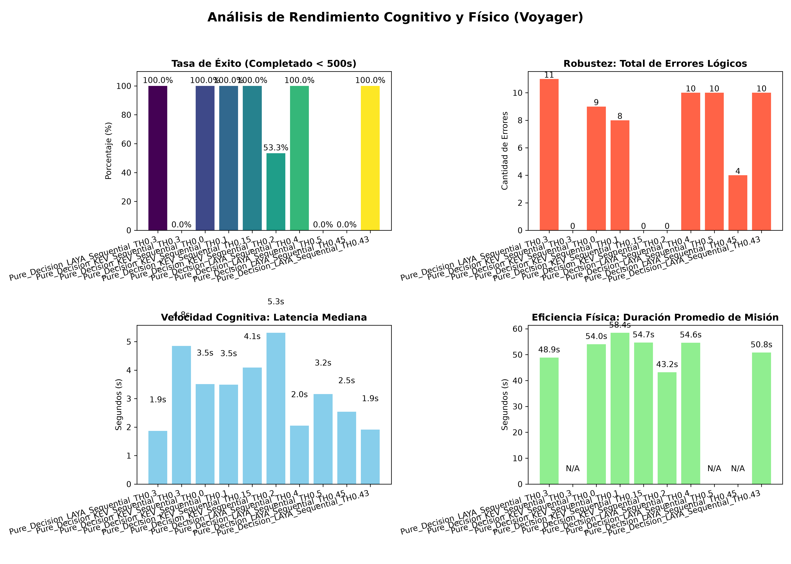
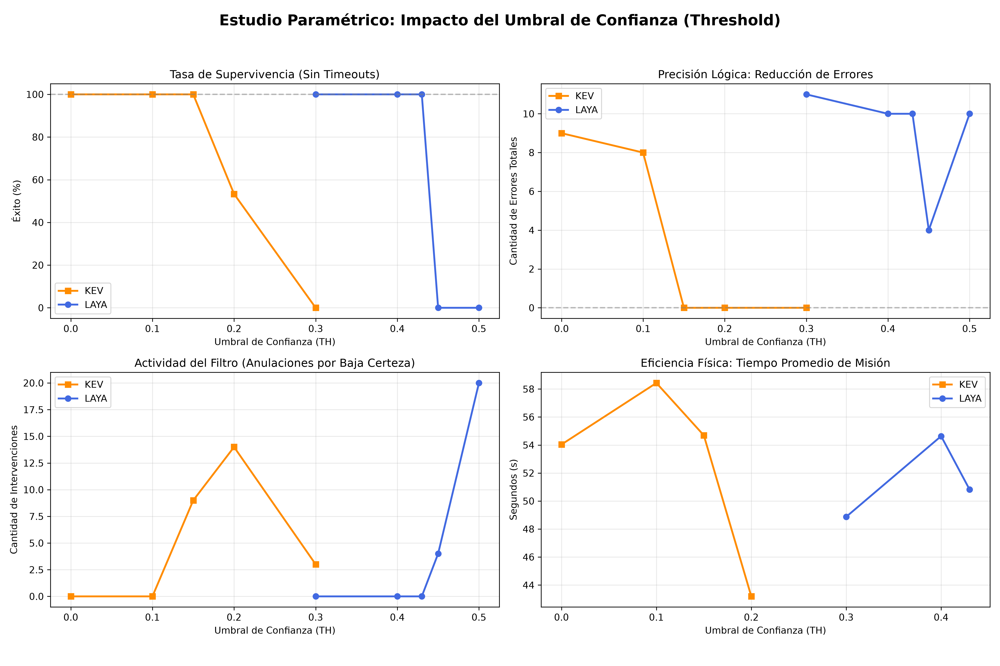

# Arquitectura de Decisión Pura Secuencial (Voyager v3.5)
**Estado**: Estable / Optimización Paramétrica | **Paradigma**: Clasificación Dinámica (Jev-like) con Aislamiento de Contexto

Esta iteración abandona los Modelos de Lenguaje Generativos (LLMs) autorregresivos en favor de motores de Decisión Pura (`Laya` y `Kev`), transformando el razonamiento libre en un problema matemático de opción múltiple estructurada. Diseñada específicamente para optimizar entornos de recursos limitados (como simulaciones 3D simultáneas en Unity), esta versión elimina las alucinaciones sintácticas y reduce drásticamente la latencia computacional.

## 1. Motores de Inferencia Intercambiables
El servidor central implementa un conmutador cognitivo (`DECISION_ENGINE`) que permite alternar la tecnología subyacente de inferencia sin modificar el código fuente del entorno en Unity:

* **Laya (Router CPU)**: Inferencia ultrarrápida nativa en Python cargada directamente en la memoria RAM, ideal para pruebas de alto volumen.
* **Kev (API HTTP)**: Interfaz hacia un servidor local independiente, permitiendo integrar fácilmente variantes paramétricas de la familia Kev (ej. `kev-0.8b` o `kev-4b`).

## 2. Pipeline de Consultas Secuenciales Aisladas
Para erradicar la "lógica invertida" y la parálisis por exceso de contexto, el agente procesa su entorno en dos fases estrictamente aisladas:

### Fase 1: Filtro de Relevancia y Retoma de Acción
Cuando el sensor de odometría detecta una nueva entidad, el sistema pausa y lanza una consulta semántica tipo `choice` (USEFUL vs USELESS).

* **Descarte Semántico**: Si la entidad es detectada como chatarra, se añade a la memoria estricta `known_useless_entities`.
* **Recuperación de Estado**: El agente revisa su historial de telemetría y retoma automáticamente la acción física anterior de forma ininterrumpida (ej. si estaba aproximándose a un servidor y detecta basura periférica, la ignora sin recalcular la ruta principal). El flujo cognitivo termina aquí, ahorrando el cómputo de la Fase 2.

### Fase 2: Decisión Estratégica
Si hay entidades validadas en `known_useful_entities`, se construye una nueva consulta dinámica de opción múltiple. El diccionario de criterios (`criteria`) se inyecta únicamente con `EXPLORE` y los identificadores de las entidades estrictamente validadas, haciendo imposible la interacción accidental con distractores.

## 3. Barreras de Seguridad Lógica
### A. Memoria Cognitiva de Frustración (Anti-Bucle)
Para solucionar el "Bucle de Estancamiento de Estado" (ej. ordenar interacciones infinitas contra un servidor cerrado por falta de llaves lógicas), el orquestador en Python memoriza el estado exacto del inventario (`last_inventory_state`). Si el agente ordena `INTERACT` pero en el siguiente ciclo cognitivo su inventario no ha cambiado, el sistema deduce que la acción física fracasó. Inmediatamente bloquea temporalmente el objetivo (`blocked_interaction_target`), penalizando matemáticamente la opción y forzando al modelo a explorar para buscar los requisitos faltantes.

### B. Umbral de Confianza Paramétrico (Confidence Threshold)
A diferencia de los LLMs estándar, los modelos clasificadores devuelven una métrica de certeza matemática para cada decisión. El parámetro calibrable `CONFIDENCE_THRESHOLD` actúa como red de seguridad algorítmica final:

* Si el modelo elige interactuar, pero su nivel de certeza es inferior al umbral establecido, el orquestador anula la decisión, emite un Override en el registro, y ejecuta la acción determinista segura: `EXPLORE`.

## 4. Telemetría y Análisis Estadístico
El puente de comunicación genera un registro JSON enriquecido por iteración, estructurado para análisis paramétrico comparativo:

* **Etiquetado Dinámico**: Identificador de arquitectura y umbral (ej. `Pure_Decision_LAYA_Sequential_TH0.43`).
* **Telemetría de Latencia**: Promedios, medianas, picos y mínimos de velocidad cognitiva en segundos.
* **Trazabilidad de Errores**: Conteo estricto de Errores Lógicos (interacciones con chatarra o servidores prematuros).
* **Auditoría de Intervenciones**: Registro de Anulaciones por Baja Confianza (Overrides del Filtro).
* **Control de Supervivencia**: Mapeo de misiones completadas exitosamente vs Timeouts excedidos.

# Resultados de las pruebas

## Comparación de umbrales
